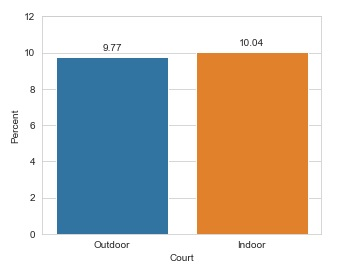
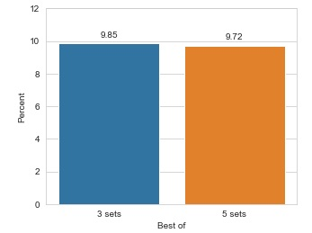
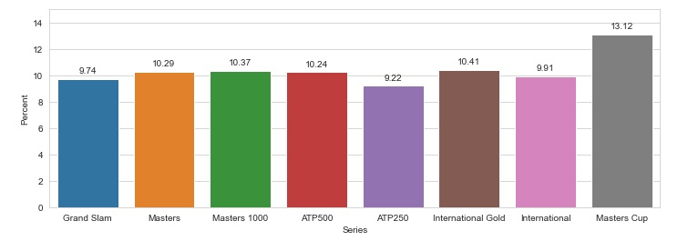
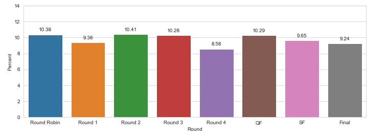
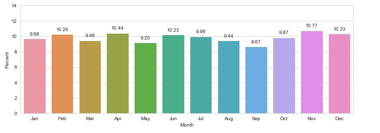
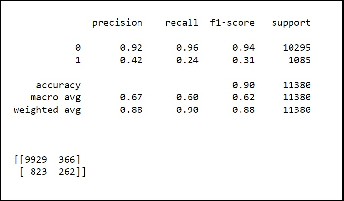

# Exploring patterns and predicting long-shot betting odds in tennis matches

For the purposes of this analysis, a <b>long-shot bet</b> was defined as bets with odds >= 3.0 (i.e. a minimum profit of 2 units for every 1 unit bet) as offered by the online bookmaker bet365.com in professional men's tennis matches from 2005 to 2019.

The data used was from the ATP men's tour for these 15 years, and is available for public download <a href="https://www.kaggle.com/hakeem/atp-and-wta-tennis-data">here</a>. 

After extensive cleaning, the dataset reduced to a sample of 38 thousand tennis matches. An exploratory analysis of this data did not show any clear correlations that could predict whether long-shot bets came through. For example:

<b>1. COURT</b> - long-shot bets won equally (approximately 10% of the time) on both indoor and outdoor courts:

<b>2. MATCH LENGTH</b> - both 3-set and 5-set games resulted in equal amounts of winning long-shots:

That said, some features showed a bit of correlation with long-shot odds. For example:

<b>1. TOURNAMENT</b> - Masters Cup events had a higher probability of upsets:

<b>2. SURFACE</b> - long-shots were more likely to win on Carpet surfaces:

<b>3. ROUND</b> - a slightly greater chance of long-shots in earlier rounds:

<b>4. MONTH</b> - more upsets happen in winter months (northern hemisphere) than summer:

After analysing various features, only the following were retained in the dataset for building the model:

<ul>
<li>Best of: 3 set or 5 set games</li>
<li>Comment: Completed or Retired</li>
<li>Court: Outdoor or Indoor</li>
<li>Round: Stage of the tournament</li>
<li>Series: Type of tournament</li>
<li>Surface: Playing surface</li>
<li>Year: This might have some bearing as players peak at different times</li>
<li>Month: This might have some effect as some player play better on certain months</li>
<li>Rank Difference: Difference in rank of players</li>
</ul>

Classification models were applied on the data, with the best accuracy achieved by a Random Forest model. However, the accuracy of false negatives was too low to consider the model useful for real-life betting, at least based on this limited model (more feature engineering such as accounting for form/winning streak or whether the tournament was played in a player's home country etc might improve the accuracy):

On a side note, the win% of long-shots in comparison to the odds offered by bookies shows a definite edge maintained by bookmakers. In this sample:

<ul>
<li>For matches with offered odds of exactly 3.0 (i.e. a win expectation of 33%), the number of atual wins was 29.55%</li>
<li>For matches with offered odds of exactly 4.0 (i.e. a win expectation of 25%), the number of atual wins was 21.89%</li>
</ul>

